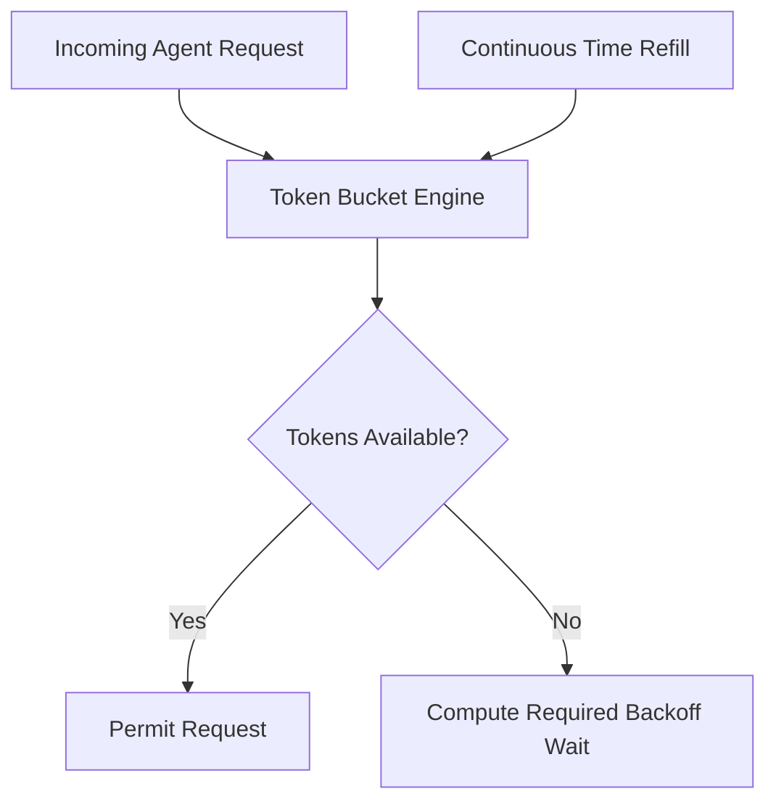

# genpark-token-bucket-rate-limiter-burst-controller-skill

Token bucket rate limiter with burst shaping designed for LLM API token quotas (TPM/RPM) and multi-agent resource budgeting.

## Architecture

## Features
- **Continuous Clock Refill**: Exact fractional token replenishment based on high-resolution timestamps.
- **Burst Accommodation**: Handles momentary traffic surges up to max capacity.
- **Zero Dependencies**: 100% Python standard library.
